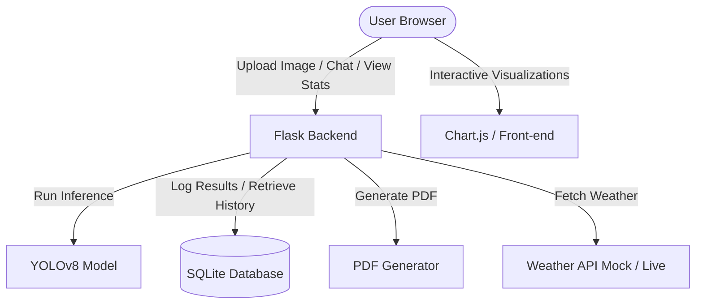

# Implementation Plan: Plant Disease and Nutrient Deficiency Web Portal

We will convert the Streamlit plant disease and nutrient deficiency detection application into a premium, responsive, and feature-rich Flask web application. The frontend will be styled using custom modern Vanilla CSS (featuring glassmorphism, responsive grid layouts, earthy gradients, and micro-animations) and vanilla JS for async predictions, interactive graphs, and a chatbot.

---

## Proposed System Architecture

---

## User Review Required

> [!IMPORTANT]
> **Dependencies to Install**: We will need to install `flask` and optionally `reportlab` (for PDF generation). These will be added to the project.
> We will run: `pip install flask reportlab` inside the environment.
> Please review and approve the planned styling scheme (earthy green/gold gradients, clean card-based layout, glassmorphic headers, responsive sidebar/navbar, and smooth dark-mode toggle).

---

## Proposed Changes

### Backend (Flask & Model)

#### [NEW] `server.py`
Create the main Flask application handling:
- **Routes**:
  - `/` (Dashboard/Prediction page)
  - `/history` (Database history viewer & Chart.js stats)
  - `/chatbot` (API endpoint for AJAX chat support)
  - `/download-report/<id>` (Generate and stream a PDF analysis report)
- **Database Logic**: SQLite database creation/connection helper (`db.py` or inline in `server.py`).
- **Prediction Logic**: Load YOLOv8 model (`weights/best.pt`) once on start and run inference on uploaded images.

#### [NEW] `db.py`
A clean database utility to:
- Initialize the SQLite database and create `analyses` table (fields: id, filename, prediction, confidence, nutrient, fertilizer, timestamp).
- Insert analysis logs.
- Retrieve past logs and query aggregations for stats (such as disease count for charts).

---

### Frontend (Templates & Assets)

We will structure the frontend assets inside standard Flask directories:
- `templates/` for HTML files.
- `static/` for CSS, JS, and uploaded images.

#### [NEW] `templates/base.html`
Main boilerplate template including:
- Premium navbar/sidebar with page navigation.
- CSS and JS imports.
- Toast notifications container.
- Theme toggle (Light/Dark mode).

#### [NEW] `templates/index.html`
The primary dashboard layout:
- **Hero section** with drag-and-drop leaf image uploader.
- **Analysis section** (hidden until prediction finishes, loads via AJAX):
  - Leaf image display.
  - Interactive cards showing disease class, confidence bar, nutrient deficiency, and fertilizer recommendations.
- **Weather widget**: A beautiful sidebar card displaying local farm-oriented weather recommendations (mocked, or fetching if keys exist).
- **Interactive Chatbot widget**: Floating chatbot helper.

#### [NEW] `templates/history.html`
History and statistics page:
- **Stats Dashboard**: Beautiful dashboard containing Chart.js graphs displaying:
  - Distribution of detected diseases.
  - Success/Confidence trends.
- **History Table**: Filterable and searchable table of previous logs with actions to download reports or view details.

#### [NEW] `static/css/style.css`
Custom, premium CSS stylesheet:
- **Palette**: Forest greens, emeralds, gold/amber warnings, clean slate/dark mode backgrounds.
- **Glassmorphism**: Backdrop-filter effects, subtle borders, shadows.
- **Typography**: Google Fonts ("Outfit" or "Inter").
- **Animations**: Hover scales, pulse effects on dropzone, sliding menus, fade-in results.
- **Theme Variables**: Custom properties for `--bg-color`, `--card-bg`, `--text-color` etc. for easy dark/light mode toggling.

#### [NEW] `static/js/main.js`
Client-side JavaScript to handle:
- **Drag-and-drop uploader**: Interactivity and preview before uploading.
- **AJAX Inference request**: Sending image to server and dynamically updating the page with a clean loading animation.
- **Chatbot widget interaction**: Submitting questions and rendering user/bot chat bubbles.
- **Theme Switcher**: Saving choice in `localStorage` and toggling class on body.

---

## Verification Plan

### Automated & Manual Verification
1. **Dependency Installation**: Install `flask` and `reportlab` and ensure they install correctly.
2. **Model Integration**: Verify `server.py` can load `weights/best.pt` and run predictions on `test_leaf.jpg` successfully.
3. **Database Logging**: Run a test upload and verify an entry is created in `database.db`.
4. **Interactive Testing**: Open the web portal in the browser, upload a leaf, observe prediction results, view history tables, look at dynamic charts, export report as PDF, test chatbot responses, and toggle Dark Mode.
